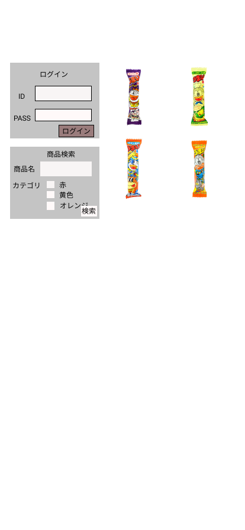

## 目次
- [ER図](#usage)
- [機能一覧](#usage1)
- [うまい棒](#usage2)

<h2 id="usage">ER図</h2>
http://www.plantuml.com/plantuml/png/fPLVJnj74C3VxrDipGEf6jTOIlyaGYX0gOHIGmL-gQhgjFKjvihzSVVE0WkGsBsMG00r3GAQqbBIXc8W65JJbYWk_J3BsTSdlaBtzino94P1oZwiTtPcP-StCxU-wxWGkqNJK5Bj2W3-UfMHokdnFYFRZVLAOs-1aLyOMHVpDuoMcLTbtYoZlpLdijVuUIQO_uEHnumAOqgu1-vAR5RyXql-_D9PRSwl_5XVEJohpJFwYAyR9ply2aQM63a9pyvGVcJKTGlEdLIgO40hZEdTd6scle8fPqot2X13KsbFASfR6XhHBGGotSFPlY4rqprqJ-qT_6Hm20nYQEKHa1RPeUw1uUxURF_WGDpi8uGAmsEb7gE85AMTqKFcxJ3lFlDgZFxDlEsGaQnmQaxaRnxv3-T0syH4Sc8YTdN_WDetaEtFVWRQChhbzc84pMH6TzpIaEqW9SgcSBh2AFU-nxmvdX4Edv0q86T0nqdmF0JbVPuJHjPaDaBIbmp1f0BuQ8zg57YBzSS7OgS7viRos2vQMgzjs1WCM_PutBI-iHdPsLX3EBBfCVYXo8XvkynxTfc-mcCLscwCxV7uaMb5AV1VoFESwEjbz4z6dtAs180ES27E8rTrIewBp6Qu8X7XODu6eyyP_JUyoPiLysgO6Fe8PDWCuKv47QgC_iNeWGmcr6S18xkCX2qJF2a7vH-QFizgtzTNx_lxQw6QpeF4wV6B1BSjCx804lx9SYYSy8FrjQtwJy-2tOsmwIZb7eBQlF_TGU3z4xdYwHOBPBcwMmA9_vvi-vLVPSm2BrTqNDj467IQwldQwGATdPcRh_HYLvVWZyOxygYQipK4Fl_qtXTIcKpAPO5NMGeMD94KeAPX55Ewo91h4-eNWeOCTSI0URc1KLxLe1kvchuC6LHh_hTRyM88Jj4ce5DJ2qMS6uKE2XcpDrjzJG8q_ZN4eOKVLTUkv6rxEIyVn-pEBvVHH-2s2msrWFMS96g15EnK6qU7hS5K3RayOt6-vjQROe8OgD14ReNgwXJeBZ9Ru4j4CQoYsHBNNvdrbycbDXKEdR17nU9w_Ic3k39GOH7lIHcXh2LqKTx69Svx6KKtOLuQYgHShs5Ry3Aw9_vuZiIZ5QEMjuVWv-lhiSVYlf9UWhUCS5g-zx5dZLGOUIgUhKL67t0nUdJggy_hrPNOdztNkkv2yKzd5Z4SWwQUDCsKg5tgLkwz3Yrz-zPj-E6NwOwEzFjev8Ce8Kan-E9EMifJKq86qDA0RHabSA6oXQe3s3YscPmCDqrebIvSYArqQ6VQ684RwTCNMwV73zw-y3GfFOKdmOsESmk5aML65ndPPAJSEFwTaRrO1XOK-Nn6OyfkEWFH5wI86SWnDTKC1rpwRfMu80eGWiiMTHGn0pccxNEzB3JFe856t73BG0h0Uduq5B2kW691MF9V1MZsk2KwrEObRa-rY1_hhoF0-ZKPDFjr50PwbOEFkyZIYgRnFm00)

<h2 id="usage2">うまい棒</h2>
https://www.figma.com/proto/A5ZUIvNaORedbtjXYUjLS7/Untitled?node-id=1%3A2&scaling=scale-down&page-id=0%3A1&starting-point-node-id=1%3A2

*****

*****
<h2 id="usage1">機能一覧</h2>
# 機能一覧
### ECサイト機能一覧
**1.フロント**
### 注文関連

|番号|機能名|内容|データ入力|データ出力|備考|
|:---|:---|:---|:---|:---|:---|
|1-1|商品紹介ページ|商品を紹介する|||
|1-2|商品詳細ページ|説明文、商品画像を拡大表示 選択、カートへボタン表示|〇|||
|1-3|ショッピングカート|買い物かごの中身を表示|〇|||
|1-4|合計金額|金額を表示||〇||

### 会員情報関連
|番号|機能名|内容|データ入力|データ出力|備考|
|:---|:---|:---|:---|:---|:---|
|2-1|会員登録|顧客の会員情報を保存する|〇|〇||
|2-2|ログイン|ログイン画面を表示する|〇|||
|2-3|会員情報編集|顧客の情報を編集する|〇|||

### 購入テーブル(d_purchase)
|和名|属性名（カラム名）|型|PK|NN|FK|
|:---|:---|:---|:---|:---:|:----:|
|オーダーID|order_id|bigint(20)|〇|〇||
|顧客コード|customer_code|varchar(50)||〇||
|購入日|purchase_date|date||〇||
|総額|total_price|int(11)||〇||

### 購入詳細テーブル(d_purchase_datail)
|和名|属性名|型|PK|NN|FK|
|:---|:---|:---|:---|:---:|:----:|
|オーダー詳細ID|detail_id|bigint(20)|〇|〇||
|オーダーID|order_id|bigint(20)|〇|〇|〇|
|商品コード|item_code|int(11)||〇||
|価格|price|int(11)||〇||
|数量|num|int(11)||〇||
